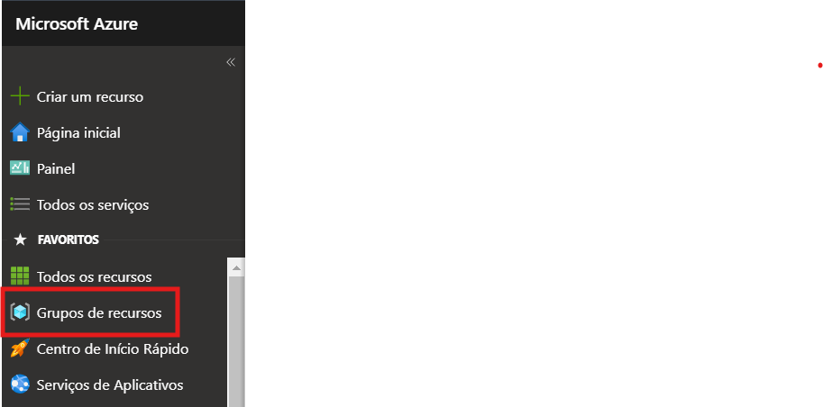

# Análise de Documentos Anti-fraude com AzureAI - Criação dos Recursos

Primeiramente devemos criar um grupo de recursos para alocar a nossa aplicação. 

Portal > Grupo de recursos > Criar

Preencha os dados conforme print abaixo e clique em “Revisar + criar”

Após acessarmos o grupo > Criar (para criarmos dois recursos necessários para esse laboratório)

Pesquise “Storage Account” > Criar (conforme print)

Preencha conforme print abaixo > “Revisar + criar”

Agora criaremos o recurso “Document Intelligent”:

Preencha conforme imagem abaixo > Examinar + Criar

